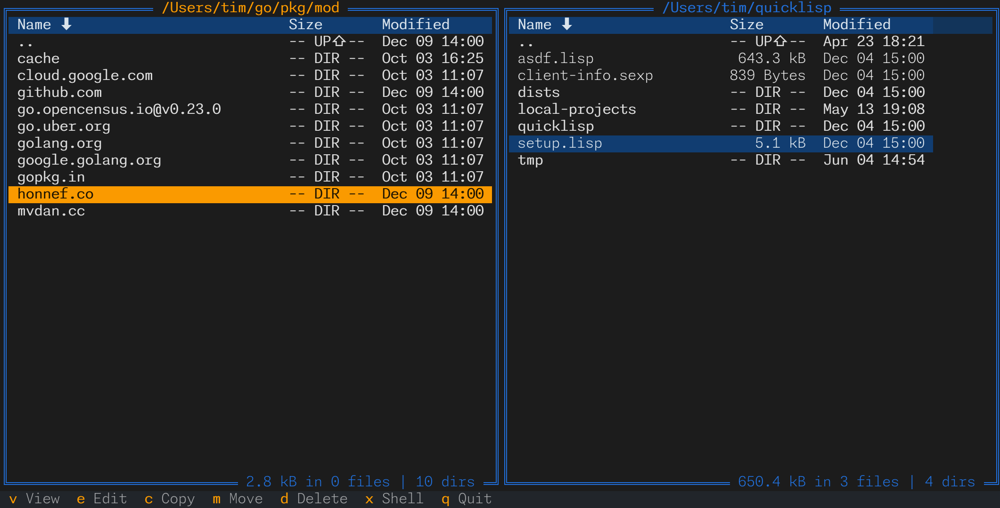

# F2 Commander

F2 Commander is an orthodox file manager for the modern world.

## Status

In development. Basic features work, but consider it unstable to be safe.

See the complete feature list below.

## Installation

Installation from source only, until considered stable.

    poetry build
    pipx install [--force] dist/f2_commander-0.1.0.tar.gz

## Development environment

This project uses Poetry for dependency management and as a build tool. The
configuration is conventional, use as usual:

    poetry install --with dev

It also uses black, flake8, isort, mypy and pytest. An IDE or an LSP should
pick up their configuration, or they can be executed with poetry. For example:

    poetry run pytest

To run all code quality controls and linters:

    ./check

To run the application from source code:

    poetry run f2

To run the application with dev tools:

    poetry run textual console [-v -x SYSTEM -x EVENT -x DEBUG -x INFO]  # run first!
    poetry run textual run --dev f2.app:F2Commander

## Roadmap

F2 Commander mission is to bring the experience of an orthodox file
manager into the world of modern computing.

F2 Commander main principles are:

 - "file system" can be anything that contains files, blobs, etc.
 - focus on the **tasks** for file manipulation
 - discoverability of file systems (making file systems easy to navigate)
 - discoverability of the tool itself (making it easy and evident to use)

Features:

 - User Interface
   - [x] Two-panel interface
   - [x] Classic footer with common user actions
     - [ ] Contextual footer (changes actions based on context)
     - [ ] Configurable key bindings. "Modern" and "Retro" bindings out of the box.
   - [ ] Menubar
   - [ ] Command Palette
   - [ ] File Info panel
   - [ ] Preview panel
   - [x] Drop to shell (command line) temporarily
   - [ ] Theming. "Modern" and "Retro" themes out of the box.

 - Configuration
   - [ ] Open configuration. User-defined overrides from a config file.
   - [ ] UI for most common configuration options
     - [ ] Options for user-defined viewer, editor, shell, and default file actions
     - [ ] Enable/disable CWD following the user selection

 - Navigation
   - [x] Basic file and directory info: entry names, human-readable size,
         last modification time, show and follow symlinks, etc.
   - [x] Vim-like (up/down j/k g/G ctrl+f/d/b/u) navigation
   - [x] Navigate "up" (with backspace or with the ".." entry)
   - [x] Order entries by name, size, time (last modification time)
   - [x] Filter entries with glob
   - [x] Directory summary in the file listing footer
   - [ ] "List dirs first/inline" toggle
   - [ ] Quick search: navigate file list by typing in the file names
   - [ ] Navigate to path (enter path, with auto-completion)
   - [ ] Bookmarks (set and navigate to the bookmarks)
   - [ ] "Same location" and "Swap panels" actions
   - [ ] CWD follows user selection
   - [ ] Detect external changes and update file listging when possible
   - [x] Open current location in the OS default file manager

 - File and directory manipulation
   - [x] Basic operations like copy, move, move to trash, etc.
     - [x] Confirmation dialogs and user inputs (destination path, etc.)
     - [x] Multiple file selection
     - [ ] Progress bar for long operations
     - [ ] Option to delete files (as opposed to moving to trash)
   - [x] View and edit files using user default viewer and editor
   - [x] "Open" files with a default associated program (e.g., view PDF, etc.)
   - [ ] Run programs (run executable files)
   - [x] Create a new directory
   - [ ] Create a new file
   - [x] "Show/hide hidden files" toggle
   - [ ] Create and modify symlinks, show broken, and other symlink tasks
   - [ ] Compute directory size on selection

 - "File systems" support
   - [x] "Local" OS file system
   - [ ] AWS S3
   - [ ] GCP GCS
   - [ ] Dropbox
   - [ ] FTP, FTPS, SFTP
   - [ ] ... show must go on ...

 - Archival and compression support
   - [ ] ZIP (read, create, update)
   - [ ] ... and more ...

 - Documentation
   - [ ] Buit-in help
   - [ ] User manual

 - Windows support. You are probably better off with WSL, but some day, maybe...
   - [ ] Test all features in Windows
   - [ ] Then, maybe plan fixes

User experience and app behavior:

 - Dialogs
   - [ ] "Do not ask me again" option in "safe" dialogs (e.g., "Quit" dialog)
   - [ ] Allow "Enter" and "y" keys in "safe" dialogs for confirmation

 - Navigation
   - [ ] Consistent cursor positioning
     - [x] ... on the source directory when navagating "up"
     - [ ] ... on the source link when navigating back from symlink
     - [ ] ... on the nearest entry after delete or move

Known bugs to fix:

 - Restore the "show hidden files" state when switching back to the file list
   after having used a different panel type.

 - Errors in copy, move, etc. are not handled (e.g., destination directory
   doesn't exist, etc.). Note that not only preconditions should be checked,
   but also the errors should be handled (e.g., destination can be deleted
   during copy, network connection dropped, etc.)

 - ".." path is allowed for selection and can be copied, moved, etc.; handle
   ".." and empty selections better

 - Empty selections

 - File info and preview panels show nothing on start unless a slection is
   changed in the file list.

 - Default viewer, editor, shell and "open" programs are mostly MacOS-specific,
   choices are too rigid. Make sure deafults work on clean MacOS and Linux
   installs.

 - File list has an unnecessary 2-column (2 characater wide) gap even when no
   vertical scroll bar is present (2 characters are reserved for the scroll
   bar)

 - Ctrl+U / Ctrl+D should scroll half a page (not en entire page)

 - Selection is always cleared if "Hidden files" toggle is changed
